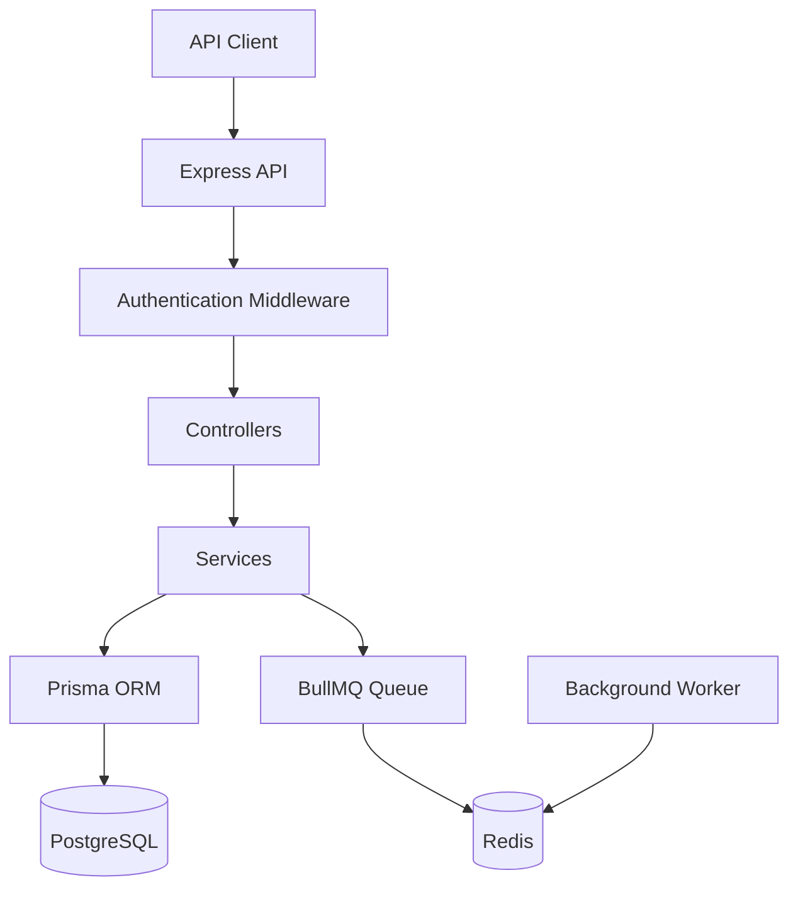

# TaskFlow — Architecture Overview

## Overview

TaskFlow is a multi-tenant task management REST API built with Node.js and Express.

The system separates HTTP handling, business logic, persistence, authentication, and background processing.

## High-Level Architecture



## Main Components

### Express API

Receives HTTP requests and returns JSON responses.

### Middleware

Authentication middleware validates access tokens and attaches authenticated user and organization context to the request.

### Controllers

Controllers handle:

- Request validation
- HTTP status codes
- Response formatting
- Mapping service errors to API responses

### Services

Services contain business logic and database operations.

### Prisma

Prisma provides database access to PostgreSQL.

### PostgreSQL

Stores application data including users, organizations, members, projects, tasks, and assignments.

### Redis and BullMQ

Redis is used by BullMQ for background job processing.

## Request Flow

```text
Client
  ↓
Express Route
  ↓
Authentication Middleware
  ↓
Controller
  ↓
Service
  ↓
Prisma
  ↓
PostgreSQL
  ↓
JSON Response
```

## Multi-Tenancy

Organization ID is used as the tenant boundary.

Protected resources are checked against the authenticated user's organization before access is granted.
