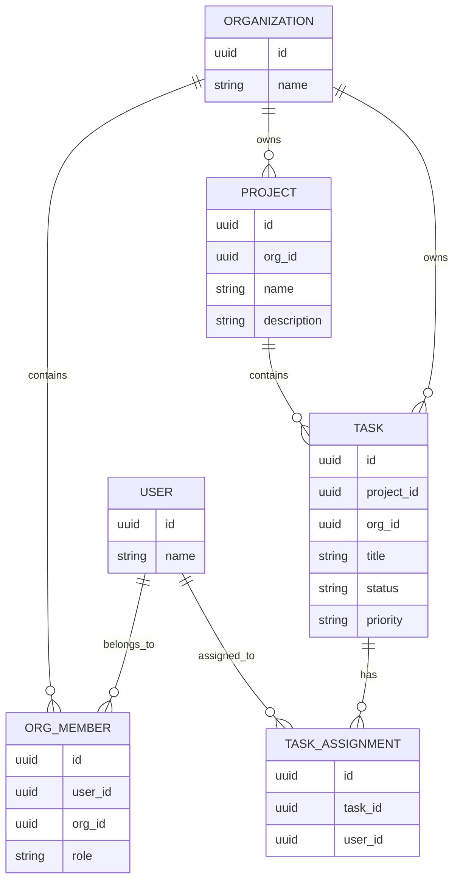

# TaskFlow — Database Architecture

## Database

TaskFlow uses PostgreSQL with Prisma ORM.

## Main Domain Entities



## Organization Membership

Users belong to organizations through the organization member relationship.

The membership contains the user's organization-specific role.

Supported roles:

```text
org_admin
member
```

## Projects

Projects belong to an organization.

A project cannot be accessed through another organization's context.

## Tasks

Tasks belong to an organization and can also belong to a project.

Tasks support status and priority filtering.

## Task Assignments

A task can be assigned to organization users.

The API validates that the assigned user belongs to the same organization as the task.

## Tenant Boundary

The organization ID is the primary tenant boundary.

Services verify organization ownership before returning or modifying protected resources.
