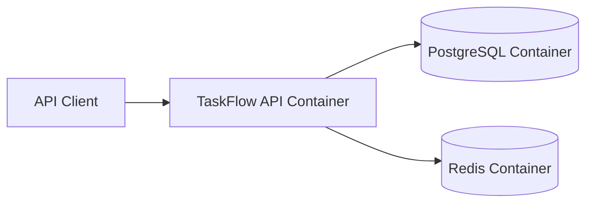

# TaskFlow — Deployment Architecture

## Docker Environment

TaskFlow is designed to run using Docker Compose.

The environment contains the application and its infrastructure dependencies.



## Start the Project

Create the `.env` file required by the project.

Then run:

```bash
docker compose up --build
```

The API is available at:

```text
http://localhost:3000
```

## API Documentation

Swagger UI:

```text
http://localhost:3000/api-docs
```

Health endpoint:

```text
http://localhost:3000/health
```

## Stop the Environment

```bash
docker compose down
```

## Environment Configuration

Environment variables are supplied through `.env`.

The API uses environment configuration for values such as:

- Port
- PostgreSQL connection
- JWT secret
- Redis connection

Within Docker Compose, services communicate through their Docker service names.
